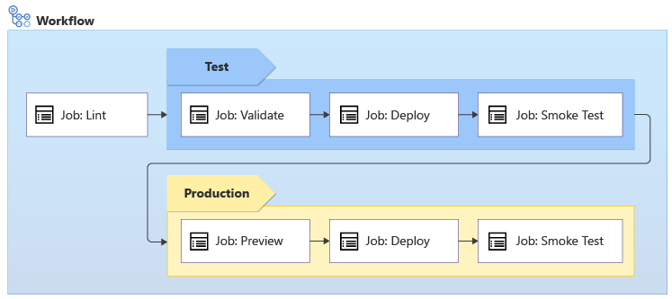
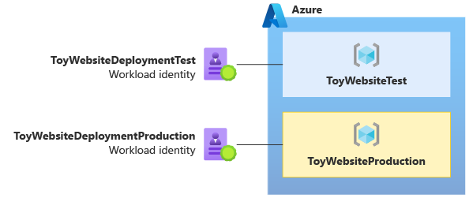

# Azure View
A publicly available real-time web dashboard for visualizing Azure's REST API.

## Data Flow
1. User interacts with the front-end, selects service from dropdown.
2. A single Azure Function (`fetch-and-store.ps1`) is triggered, retrieving JSON data from Azure's REST API for the selected Azure service.
3. The Azure Function also stores it in Cosmos DB.
4. UI updates to reflect the latest

## Data Modeling
Data is organized based on Azure namespaces, resource types, and API versions, making it easy for users to navigate and explore.
{
    "namespace": "Microsoft.Compute",
    "resourceTypes": [
        {
            "resourceType": "virtualMachines",
            "apiVersions": ["2021-07-01", "2020-12-01", ...]
        },
        {
            "resourceType": "disks",
            "apiVersions": ["2021-07-01", "2020-12-01", ...]
        }
    ]
}

Provider Namespace
│
└── Resource Type
    │
    └── API Version
## CI/CD
- GitHub Actions Deployment to multiple environments

https://learn.microsoft.com/en-us/training/modules/manage-multiple-environments-using-bicep-github-actions/2-understand-environments
separate workload identities for each environment

- https://learn.microsoft.com/en-us/training/modules/manage-multiple-environments-using-bicep-github-actions/4-exercise-set-up-environment?pivots=powershell
Handle similarities between environments by using reusable workflows,Called workflow inputs and secrets
Use workload identities from called workflows
Conditions
store most your parameter values in parameter files, and then set secure values by using a secret.
Clean up the resources
az group delete --resource-group ToyWebsiteTest --yes --no-wait
az group delete --resource-group ToyWebsiteProduction --yes --no-wait

Task	Environments
Lint	Neither - linting doesn't work against an environment
Validate	Test only
Preview	Production only
Deploy	Both environments
Smoke Test	Both environments

 protection rule to the production environment

## Infrastructure as Code (IaC)
- `main.bicep` orchestrates Azure resources and includes references to frontend.bicep and backend.bicep.
- `frontend.bicep` sets up the Azure App Service with React and D3.js, featuring responsive design, search functionality, and manual refresh.
- `backend.bicep` includes an Azure Function running PowerShell, Azure Cosmos DB with the `resourceType` as the partition key, 24 hour TTL, and default automatic indexing

## Version Control
All code is stored in a Github repository and version controlled with Git