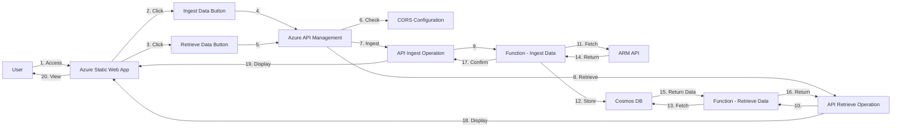

# ARM Viz
ARM Viz is a public website that helps to visualize the hierarchy and availability of [Azure Resource Manager REST API](https://learn.microsoft.com/en-us/rest/api/resources/) offerings. Utilizing a browsable Sunburst Chart, it provides a comprehensive yet simplified representation of Azure namespaces, resource types, and API versions.

## Data Flow
1. The "ingest data" button uses Azure Static Web App API to trigger an Azure Function to fetch and store the latest JSON data for all Azure namespaces, resource types, and API versions from the ARM API within A Cosmos DB Table.
   
2. Similarly, the "retrieve data" button  triggers a seperate function to retrieve the latest data from Cosmos DB and populate the Sunburst Chart.




## Data Modeling
Data is organized based on Azure namespaces, resource types, and API versions, making it easy for users to navigate and explore the Sunburst Chart.

- JSON snippet:
    ```json
    {
        "namespace": "Microsoft.Compute",
        "resourceTypes": [
            {
                "resourceType": "virtualMachines",
                "apiVersions": ["2021-07-01", "2020-12-01", ...]
            },
            {
                "resourceType": "disks",
                "apiVersions": ["2021-07-01", "2020-12-01", ...]
            }
        ]
    }graph TB

    A[ARM Viz Platform]

    B1["Ingest Data Button"]
    B2["Retrieve Data Button"]

    C1[Azure Static Web App API]
    C2[Azure Static Web App API]

    D1[Azure Function: Fetch Data]
    D2[Azure Function: Retrieve Data]

    E1[ARM API]
    E2[Cosmos DB Table]

    F[Sunburst Chart]

    A --> B1
    A --> B2

    B1 --> C1
    B2 --> C2

    C1 --> D1
    C2 --> D2

    D1 --> E1
    D2 --> E2

    E1 --> E2

    D2 --> F

    ```

## CI/CD Orchestration
- Deployment to multiple environments via Github Actions
    
  [Learn More](https://learn.microsoft.com/en-us/training/modules/manage-multiple-environments-using-bicep-github-actions/2-understand-environments)
  
- Separate workload identities for each environment  
    
  [Learn More](https://learn.microsoft.com/en-us/training/modules/manage-multiple-environments-using-bicep-github-actions/4-exercise-set-up-environment?pivots=powershell)

- Reusable Workflows and workflow inputs handle similarities and differences between environments
  [Learn More](https://learn.microsoft.com/en-us/training/modules/manage-multiple-environments-using-bicep-github-actions/3-handle-similarities-between-environments-using-reusable-workflows)

- A protection rule is added to require approval for deployment to the production environment

## IaC Orchestration

- `main.bicep`: Orchestrates frontend and backend resource deployments.

- `frontend.bicep`: Sets up the Azure App Service to host the Sunburst Chart created with [Plotly](https://plotly.com/)

- `backend.bicep`: Sets up an Azure Function which runs the `fetch-and-store.ps1` script on initial deployment, and again every 24 hours. It also sets up an Azure Cosmos DB with default automatic indexing, configures a 24 hour TTL, and `resourceType` as the partition key.

## Parameters and Secrets
- Parameters that pertain to infrastructure are stored in `main.bicep`
- Secrets that pertain to CI/CD are stored in Github Actions Secrets
- Secrets that pertain to infrastructure are stored in Azure Key vault

## Security

The Function App authenticates to resources via System-Assigned Managed Identities. The Function App is granted the following roles:

## PowerShell Scripts


